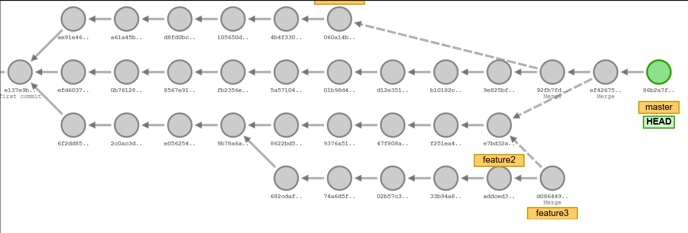

#### 🚀 Git & GitHub Basics

* Git is a distributed version control system used by developers to track changes in code. It allows multiple developers to work on a project simultaneously, maintain different versions of the code, and manage updates to the codebase efficiently. With Git, developers can create branches to experiment with new features or fixes, merge changes, and maintain a complete history of changes made to the project.

---
* GitHub is a web-based platform that provides hosting for Git repositories. It facilitates collaboration between developers by offering features like version control, pull requests, issue tracking, and code reviews. GitHub enables developers to share their code publicly or privately, contribute to open-source projects, and manage software development processes through its integrated tools for collaboration and project management.
---
#### 📌 Prerequisites
- Install [Git](https://git-scm.com/)
- Create a [GitHub](https://github.com/) account

---

#### 🛠️ Git Configuration

Set up your user information:
```sh
git config --global user.name "Your Name"
git config --global user.email "your-email@example.com"
git config --list                     #verify the configuration
git init                              #to start tracking a project
git status                            #to see the status of your repo
```


### To clone a repository, run the following command: 🖥️


```sh
git clone https://github.com/username/repository.git             #command to clone the repo
git add .                                                        #to add the the things in your repo                      
git commit -m "Your commit message"                              #  to commit the staged changes             
git push origin main                                             #to push the data to main branch
git pull origin main                                             #Pull the latest changes from the repository:

```
---
### Adding Token to Git for authentication 🔑
The first order of business is to verify our current username and email stored in the locals Git. To do that, we use the following commands,
```bash
git config --get user.name
git config --get user.email
```

### Securely Storing Credentials in Git Using `git credential approve` 🔒✅
* Open your terminal or command prompt
* Ensure you have Git installed and configured.

* Use the `git credential approve` command to securely store credentials in Git 🛠️🔑
Replace <your-username> and <your-token> with your actual GitHub username and personal access token.
```bash
git credential approve <<'EOT'
url=https://github.com
username=<your-username>
password=<your-token>
EOT
```
* Press Enter to execute the command.

* Verify stored credentials
Run the following command to check if your credentials are stored correctly:
```bash
git credential fill <<'EOT'
url=https://github.com
EOT

```
* If successful, it should return your stored credentials.

Use Git operations securely
* Now, Git will use the stored credentials when performing operations like git push and git pull without prompting for authentication.
---
### To view the log 📜👀

```bash
git log --oneline --graph                         # to see the logs


```
> **Note:**  
> This command displays a concise, one-line history of your commits along with a graphical representation of your branch structure. It allows you to easily visualize the commit history and the relationship between branches.
<br>


### Some Other Commands
```bash
git branch      #to see the branch you are in 
```   
* This command lists all branches in your repository and highlights the branch you are currently on with an asterisk (*). It's useful for confirming which branch you're working in before making changes or committing.
```bash
git diff        # to see the difference in your file

```
* This command shows the changes that have been made to files in your working directory that are not yet staged for commit. It allows you to preview the differences between your current code and the last committed version.

#### Github.io visualization

* <span style="color:yellow">  Git visualization tools, such as Git.io, help developers understand repository structures, commit histories, and branch workflows through interactive visual representations. These tools allow users to track changes, view commit timelines, and explore branching strategies in an intuitive graphical format.</span>
---
### Network Graph


* <span style="color:yellow">The Network Graph on GitHub visually represents the branching history and relationships between different forks of a repository. It helps developers track contributions, understand collaboration patterns, and see how various branches evolve over time.
</span>
---
### Creating a pull request
* <span style="color:yellow">To create a Pull Request (PR) on GitHub, push your changes to a branch and navigate to the repository. Click "New pull request", compare changes, add a description, and submit for review. 
</span>

----

### Adding a description to create pull request
* <span style="color:yellow">When creating a Pull Request, add a clear and concise description explaining the changes, purpose, and any relevant context. This helps reviewers understand and approve your PR efficiently.


### Merge the pull request
* <span style="color:yellow">Merging a Pull Request integrates the proposed changes into the target branch. Once approved, you can merge using the "Merge pull request" button on GitHub. Choose between merge, squash, or rebase strategies based on your workflow.</span>

* Merging the pull request

---
* Confirming the pull request

> **Note:** Once you click on merge pull request, you also have to manually confirm the merge by click.


