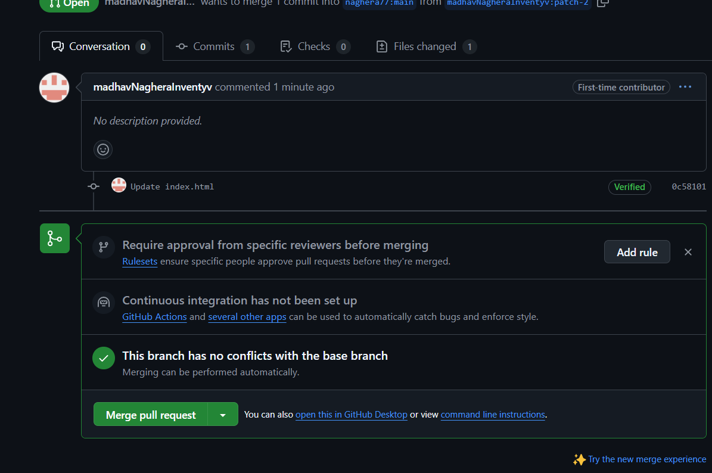

#### 🚀 Git & GitHub Basics

This guide covers the basic Git commands and how to use GitHub for version control.

#### 📌 Prerequisites
- Install [Git](https://git-scm.com/)
- Create a [GitHub](https://github.com/) account

---

#### 🛠️ Git Configuration

Set up your user information:
```sh
git config --global user.name "Your Name"
git config --global user.email "your-email@example.com"
git config --list                                                #verify the configuration
git init                                                         #to start tracking a project
git status                                                       #to see the status of your repo
```


#### To clone a repository

```sh
git clone https://github.com/username/repository.git             #command to clone the repo
git add .                                                        #to add the the things in your repo                      
git commit -m "Your commit message"                              #  to commit the staged changes             
git push origin main                                             #to push the data to main branch
git pull origin main                                             #Pull the latest changes from the repository:

```
##### Adding Token to Git
 before we explore that, we will configure our token that we created in [[#Step 2 Create a Token | Step 2]]. For that, we will be again using bash commands into our terminal, so let's ensure that we have a fresh terminal open.

The first order of business is to verify our current username and email stored in the local Git. To do that, we use the following commands,
```bash
git config --get user.name
git config --get user.email
```

If the values represented are not what you want, please follow [[#Step 3 Setup Git | Step 3]] and configure your Git.

Now we need to create a secure store of our credentials using the `git credential approve` command.

Use the below command template, edit out your own values and then paste it into your terminal.

```bash
git credential approve <<'EOT'
url=https://github.com
username=<your-username>
password=<your-token>
EOT
```

#### To view the log

```bash
git log --oneline --graph                                      # to see the logs


```

```bash
git branch                                                     #to see the branch you are in 
git diff                                                       # to see the difference in your file

```

#### Github.io visualization

Git visualization tools, such as Git.io, help developers understand repository structures, commit histories, and branch workflows through interactive visual representations. These tools allow users to track changes, view commit timelines, and explore branching strategies in an intuitive graphical format.

#### Network Graph

The Network Graph on GitHub visually represents the branching history and relationships between different forks of a repository. It helps developers track contributions, understand collaboration patterns, and see how various branches evolve over time.


#### Creating a pull request
To create a Pull Request (PR) on GitHub, push your changes to a branch and navigate to the repository. Click "New pull request", compare changes, add a description, and submit for review. 


#### Adding a description to create pull request
When creating a Pull Request, add a clear and concise description explaining the changes, purpose, and any relevant context. This helps reviewers understand and approve your PR efficiently.


#### Merge the pull request
Merging a Pull Request integrates the proposed changes into the target branch. Once approved, you can merge using the "Merge pull request" button on GitHub. Choose between merge, squash, or rebase strategies based on your workflow.
##### image 1

##### image 2


####